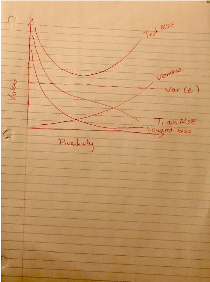

---
---

```{r setup, include=FALSE}
knitr::opts_chunk$set(echo = TRUE)
```
## 2.4 Theoretical 
3 a)



b) As seen with the bias-variance trade off, as flexibility increases, there is an increase in variance but bias will decrease. By the same token, decrease in flexibility means higher bias but lower variance. These two quantities help determine the overall outcome of the Test MSE, meaning that a poor combination of these hinders test results. This is what we see happening when flexibility increases too much and the training data might have gotten over trained. We also know that the test MSE can also never be below irreducible error, which is a constant. Additionally, other than the fact that training MSE is usually less than testing MSE in general, training MSE also improves as flexibility increases since the curve is able to create a closer fit to the data. However, it is most likely memorizing the training data as we get a closer fit. 

7 
a) 

Test Point = X1 = X2 = X3 = 0. 
Observation 1 vs. Test:
 = sqrt((0-0)^2 + (3-0)^2 + (0-0)^2) 
 = 3 

Observation 2 vs. Test:
= sqrt((2-0)^2 + (0-0)^2 + (0-0)^2) 
 = 2
 
Observation 3 vs. Test:
= sqrt((0-0)^2 + (1-0)^2 + (3-0)^2) 
= sqrt(10)
= approx 3.16

Observation 4 vs. Test:
= sqrt((0-0)^2 + (1-0)^2 + (2-0)^2) 
= sqrt(5)
= approx 2.24

Observation 5 vs. Test:
= sqrt((-1-0)^2 + (0-0)^2 + (1-0)^2) 
= approx 1.41 

Observation 6 vs. Test:
= sqrt((1-0)^2 + (1-0)^2 + (1-0)^2) 
= approx 1.73

b) KNN where K = 1 
The 1-NN to (0,0,0) is (-1, 0, 1) - observation 5. Observation 5 response is Green, therefore, our prediction will be Green.

c) KNN where K = 3

The 3-NN to (0,0,0) are:
- Observation 5  (-1,0,1) - Green
- Observation 6 (1, 1, 1) - Red
- Obsevation 2 (2, 0, 0) -  Red

which is 2/3 to Red, therefore, our prediction will be Red. 


## 2.4 Applied

8 a & b) College data set

```{r}
input_file <- "College.csv"
college <- read.csv(input_file, header = TRUE)
rownames(college) <- college[,1]
college <- college[,-1]
```
c) i & ii 
```{r}
summary(college)
# a scatterplot for every pair of variables for any given dataset
pairs(college[,1:10])
```

## Plot Outstate vs. Private

c) iii 
```{r}
plot(college$Private, college$Outstate, col = c("yellow", "red"))
```

## Plot Outstate vs. Elite
c) iv 
```{r}
# qualitative variable called Elite, by binning Top10perc variable
Elite <- rep("No", nrow(college))
Elite[college$Top10perc > 50] = "Yes"
Elite <- as.factor(Elite)
college <- data.frame(college, Elite)

# summarize the elite universities 
summary(college$Elite)

# plot 
plot(college$Elite, college$Outstate, col = c("blue", "green"))
```

c) v 

Use hist()  to produce histograms instead 

```{r}
# divide print window into 4 
par(mfrow = c(3,2))
# produce histograms for some of the quantitative variables 
hist(college$Enroll, main = "Number of Enrolled Students", col = 2, breaks = 50)
hist(college$Apps, main = "Number of Applications", col = 4, breaks = 50 )
hist(college$Accept, main = "Number of Accepted Students", col = 1, breaks = 50)
# different bins for same quantitative variable 
hist(college$Top25perc, main = "Top 25 Percent", col = 3, breaks = 10)
hist(college$Top25perc, main = "Top 25 Percent", col = 3, breaks = 50)
hist(college$Top25perc, main = "Top 25 Percent", col = 3, breaks = 100)
```

c) vi 

Further exploration of data 

```{r}
college[college$PhD > 100,]
summary(college$Accept)
```

9) Auto data set 

```{r}
auto_input_file <- "Auto.csv"
auto <- read.csv(auto_input_file, header = TRUE)
# remove missing value from data 
auto <- na.omit(auto)
# a) print quantitative and qualitative predictors -  should be all quantitative except the name predictor 
sapply(auto, class)
auto$origin <- as.factor(auto$origin)
```
Since R stores categorical variables as factors, the name predictor is qualitative, while all the other predictors are quantitative. Since origin is a multi-valued class that only seems to take on 3 values (1,2,3), this could be treated as categorical, as well. 

```{r}
# b) range of each quantitative predictor 

# filter out the qualtitative predictors 
quant_preds <- auto[sapply(auto, is.factor) == FALSE]

# apply range to the quantitative predictors 
sapply(quant_preds, range)
```

```{r}
# c) get the mean and standard deviation of each quantitative predictor 
sapply(quant_preds, function(x){c(mean(x), sd(x))})
```

```{r}
# d) remove the 10th through 85th observations. find the range, mean, and standard deviation of each predictor in the subset of the data that remains
quant_preds <- quant_preds[-(10:85),]
sapply(quant_preds, function(x){c(mean(x), sd(x))})
```
```{r}
# e) Using the full data set, investigate the predictors graphically, using scatterplots or other tools of your choice. Create some plots highlighting the relationships among the predictors. 
pairs(auto)
```

```{r}
# f) Suppose that we wish to predict gas mileage (mpg) on the basis of the other variables. Do your plots suggest that any of the other variables might be useful in predicting mpg?  
cor(quant_preds[-1], quant_preds$mpg)
```
For example, positive relation between mpg and year.
10) Boston data set
```{r}
# a) load boston data set - how many rows / columns
boston_input_file <- "Boston.csv"
boston <- read.csv(boston_input_file, header = TRUE)
dim(boston) # rows and columns
```
The rows represent the observations (n), while the columns represent the variables (predictors). 
```{r}
# b) some pairwise plots 
pairs(~ age + crim, data = boston)
```
```{r}
pairs(~ tax + age, data = boston)
```
```{r}
# c) 
associations <- cor(boston$crim, boston)
associations
```
This tells you that there is an association between other predictors. For example, some of the associated predictors are rad, tax, lstat, etc. 

```{r}
# d) Do any of the suburbs of Boston appear to have particularly high crime rates? Tax rates? Pupil-teacher ratios? Comment on the range of each predictor
par(mfrow = c(1,3))
# crime rates 
hist(boston$crim, main = "Boston Crime Rates", breaks = 10)

# tax rates 
hist(boston$tax, main = "Boston Tax Rates", breaks = 10)

# pupil teacher ratios 
hist(boston$ptratio, main = "Boston Pupil Teacher Ratios", breaks = 10)
```
Comment on the range of the predictors 
```{r}

# e) How many of the suburbs in this data set bound the Charles river?
charles <- table(boston$chas)
sprintf("There are %d suburbs that bound Charles river", charles[2:2])
```
```{r}
# f) What is the median pupil-teacher ratio among the towns in this data set?
paste0("Median for pupil teacher ratio is ", median(boston$ptratio))
```
```{r}
# g) Which suburb of Boston has lowest median value of owneroccupied homes? What are the values of the other predictors for that suburb, and how do those values compare to the overall ranges for those predictors?

lw_median <- which.min(boston$medv)
paste0("The lowest median value is suburb  ", lw_median)

boston[lw_median,]

```
``` {r}
# h) In this data set, how many of the suburbs average more than seven rooms per dwelling? More than eight rooms per dwelling? Comment on the suburbs that average more than eight rooms per dwelling.

# more than 7 rooms per dwelling 
calculate_rooms <- function(rooms){
  houses <- table(boston$rm > rooms)[2:2]
  return(houses)
}
sprintf("There are %d houses with more than 7", calculate_rooms(7))
# more than 8 rooms per dwelling 
sprintf("There are %d houses with more than 8", calculate_rooms(8))

```
## 3.7 Theoretical 
3) 
a) iii) For a fixed value of IQ and GPA, males earn more on average than females provided that the GPA is high enough.
β0 = 50, ˆβ1 = 20, ˆβ2 = 0.07, ˆβ3 = 35, ˆβ4 = 0.01, ˆβ5 = −10. X1 = GPA, X2 = IQ, X3 = Gender (1 for Female and 0 for Male), X4 = Interaction between GPA and IQ, and X5 = Interaction between GPA and Gender.
Gender: Female = 1, Male = 0 
Y(female) = 50 + 20GPA + 0.07IQ + 35GENDER + 0.01(GPA x IQ) - 10(GPA x GENDER) 
= 85 + 20GPA + 0.07IQ + 0.01(GPA x  IQ) - 10 (GPA)

Y(male) = 50 + 20GPA + 0.07IQ  + 0.01(GPA x IQ)


b) Salary (female), IQ = 110, GPA = 4.0
Salary(female) = 85 + 20(4) + 0.07(110) + 0.01(4*110) - 10(4)
= 137.1 or $137100

c) False. The p-values help determine the synergy. 

4)
a) Cubic regression is more flexible but it may just introduce additional noise and cause over fitting, meaning that the RSS for cubic training data may be lower than linear.  However, in reality, linear regression is probably better since the true relation is linear.

b) Linear regression RSS will be lower on test since the true relation is linear. 

c) Cubic regression RSS will still be lower on train. 

d) Since the true relation is not linear, it is possible that the cubic regression will have a lower RSS. However, since we do not know the true degree, the results depend on how far the true relationship is from linear regression and cubic regression. For example, if the true relation is closer to linear, then linear will be lower. 


## 3.7 Applied 
8)
```{r}
# a) Use the lm() function to perform a simple linear regression with mpg as the response and horsepower as the predictor.
lm.fit.auto <- lm(mpg ~ horsepower, data = auto)
summary(lm.fit.auto)
```
i. Is there a relationship between the predictor and the response? Yes there is a relationship between the predictor and response, as seen by low p-value. 
ii. How strong is the relationship between the predictor and the response? The R-squared value is approximately 61%,  which shows that a big part of the variability in mpg is attributed to (explained through) the  horsepower predictor. 
iii. Is the relationship between the predictor and the response
positive or negative? Negative relationship. 
iv. What is the predicted mpg associated with a horsepower of 98? What are the associated 95% confidence and prediction
intervals?

```{r}
# confidence intervals 

predict(lm.fit.auto, data.frame(horsepower = 98), interval = "confidence")

# prediction intervals 
predict(lm.fit.auto, data.frame(horsepower = 98), interval = "prediction")
```
b)
```{r}
# plot response and predictor 
plot(auto$horsepower, auto$mpg, main = "Mpg vs HorsePower")

# least squares regression line 
abline(lm.fit.auto, lwd = 3,  col = "blue")
```
c) 
```{r}
par(mfrow = c(2,2))
plot(lm.fit.auto)
```

11)
a) 
```{r}
set.seed (1)
x <- rnorm (100)
y <- 2*x+rnorm (100)
lm.fit.null.y <- lm(y ~ x + 0)
print_summary <- function(summary){
  coefficients <- summary$coefficients
  paste0("Coefficient(s): ", coefficients[,1], " Standard error(s): ", coefficients[,2], " T Value(s): ",coefficients[,3], " P Value(s): ", coefficients[,4])
}
print_summary(summary(lm.fit.null.y))
```
b) 
```{r}
lm.fit.null.x <- lm (x ~ y + 0)
print_summary(summary(lm.fit.null.x))
```
c) What is the relationship between the results obtained in (a) and (b)? We have the same p-value and t-value. This shows that we are describing the same line, where solving for x in the equation y = 2x + ε means that x = 1/2(y - ε). 
f) 
```{r}
lm.fit.x <- lm(x ~ y)
lm.fit.y <- lm(y ~ x)
summary(lm.fit.x)
summary(lm.fit.y)
```
14) a)
```{r}
set.seed (1)
x1 <- runif (100)
x2 <- 0.5* x1+rnorm (100) /10
y <- 2+2* x1 +0.3* x2+rnorm (100)
```
Y = 2 + 2X1 + 0.3X2 + ε
Intercept coefficient = 2
Slope coefficient 1 = 2 
Slope 2 coefficient = 0.3 

b) 
```{r}
# correlation between x1 and x2 
paste0("There's a strong correlation between x1 and x2: ", cor(x1, x2)) 
# their scatterplots 
plot(x1, x2)
```
c) 
```{r}
# y onto x and x^2
lm.fit.pol <- lm( y ~ x1 + x2)
summary(lm.fit.pol)
```
The p-value for x1 coefficients is < than 0.05, however the p-value for x2 is not. Therfore, we can reject for β1 but we cannot reject the null hypothesis for β2.
d) 
```{r}
lim.fit.pnull <- lm(y ~ x1)
summary(lim.fit.pnull)
```
Yes, taking a look at the p-values,  we can reject it. 
e)
```{r}
lim.fit.pnullx2 <- lm(y ~ x2)
summary(lim.fit.pnullx2)
```
Yes, we can reject. 

f) No, they do not contradict each other. As seen in the textbook, the presence of collinearity can mask the importance of a variable and cause the standard error and p-value to increase. In this case, the importance of x2 has been masked. 
g)
```{r}
x1 <- c(x1 , 0.1)
x2 <- c(x2 , 0.8)
y <- c(y,6)

# c to e 
lm.fit.pol2 <- lm( y ~ x1 + x2)
summary(lm.fit.pol2)

lm.fit.pnull2 <- lm(y ~ x1)
summary(lm.fit.pnull2)

lm.fit.pnullx22 <- lm(y ~ x2)
summary(lm.fit.pnullx22)
```

15) a) predicting per capita crime rate
```{r}
lm.fit.zn <- lm(crim ~ zn , data = boston)
lm.fit.indus <- lm(crim ~ indus, data = boston)
lm.fit.chas <- lm(crim ~ chas, data = boston)
lm.fit.nox <- lm(crim ~nox, data = boston)
lm.fit.rm <- lm(crim ~ rm, data = boston)
lm.fit.age <- lm(crim ~ age, data = boston)
lm.fit.dis <- lm(crim ~ dis, data = boston)
lm.fit.rad <- lm(crim ~ rad, data = boston)
lm.fit.tax <- lm(crim ~ tax, data = boston)
lm.fit.ptratio <- lm(crim ~ ptratio, data = boston)
lm.fit.black <- lm(crim ~ black, data = boston)
lm.fit.lstat <- lm(crim ~ lstat, data = boston)
lm.fit.medv <- lm(crim ~ medv, data = boston)
print_summary(summary(lm.fit.zn))
print_summary(summary(lm.fit.indus))
print_summary(summary(lm.fit.chas))
print_summary(summary(lm.fit.nox))
print_summary(summary(lm.fit.rm))
print_summary(summary(lm.fit.age))
print_summary(summary(lm.fit.dis))
print_summary(summary(lm.fit.rad))
print_summary(summary(lm.fit.tax))
print_summary(summary(lm.fit.ptratio))
print_summary(summary(lm.fit.black))
print_summary(summary(lm.fit.lstat))
print_summary(summary(lm.fit.medv))

par(mfrow = c(3,3))
plot(crim ~ .-crim, data = boston)
```
You can see from the summary and the plots that 'chas' is not as related to crime rates as other predictors. 
b) 
```{r}
# multiple regression model 
lm.fit.mr <- lm(crim ~ ., data = boston)
summary(lm.fit.mr)
```
We reject zn, dis, rad, black, and medv. All their p-values are less than 0.05. 
c)
```{r}
univar <- lm.fit.zn$coefficients[2]
univar <- append(univar, lm.fit.indus$coefficients[2])
univar <- append(univar, lm.fit.chas$coefficients[2])
univar <- append(univar, lm.fit.nox$coefficients[2])
univar <- append(univar, lm.fit.rm$coefficients[2])
univar <- append(univar, lm.fit.age$coefficients[2])
univar <- append(univar, lm.fit.dis$coefficients[2])
univar <- append(univar, lm.fit.rad$coefficients[2])
univar <- append(univar, lm.fit.tax$coefficients[2])
univar <- append(univar, lm.fit.ptratio$coefficients[2])
univar <- append(univar, lm.fit.black$coefficients[2])
univar <- append(univar, lm.fit.lstat$coefficients[2])

univar <- append(univar, lm.fit.medv$coefficients[2])
plot(univar, lm.fit.mr$coefficients[2:14], main = "Univariate vs Multiple Regression Coefficients", col = 2)
```
Clearly, there is a difference between univariate and multi regression coefficients. The linear regression model often ignores the regression coefficients for other predictors.  In multiple regression, we can say that the slopes of predictors represent an average effect while holding other predictors fixed. 

d)
```{r}
lm.fit.zn.poly <- lm(crim ~ poly(zn, 3) , data = boston)
lm.fit.indus.poly <- lm(crim ~ poly(indus, 3), data = boston)
lm.fit.nox.poly <- lm(crim ~ poly(nox,3),  data = boston)
lm.fit.rm.poly <- lm(crim ~ poly(rm, 3),  data = boston)
lm.fit.age.poly <- lm(crim ~ poly(age, 3), data = boston)
lm.fit.dis.poly <- lm(crim ~ poly(dis, 3),  data = boston)
lm.fit.rad.poly <- lm(crim ~ poly(rad,3), data = boston)
lm.fit.tax.poly <- lm(crim ~ poly(tax,3), data = boston)
lm.fit.ptratio.poly <- lm(crim ~ poly(ptratio,3), data = boston)
lm.fit.black.poly <- lm(crim ~ poly(black,3), data = boston)
lm.fit.lstat.poly <- lm(crim ~ poly(lstat,3), data = boston)
lm.fit.medv.poly <- lm(crim ~ poly(medv,3), data = boston)
summary(lm.fit.zn.poly)
summary(lm.fit.indus.poly)
summary(lm.fit.nox.poly)
summary(lm.fit.rm.poly)
summary(lm.fit.age.poly)
summary(lm.fit.dis.poly)
summary(lm.fit.rad.poly)
summary(lm.fit.tax.poly)
summary(lm.fit.ptratio.poly)
summary(lm.fit.black.poly)
summary(lm.fit.lstat.poly)
summary(lm.fit.medv.poly)
```